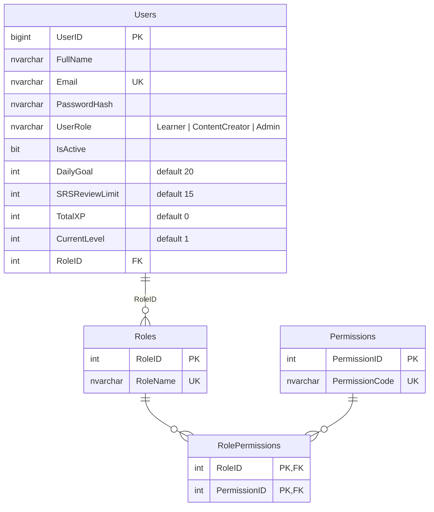
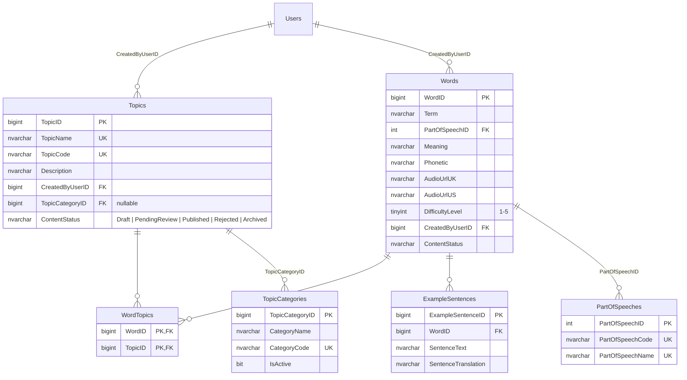
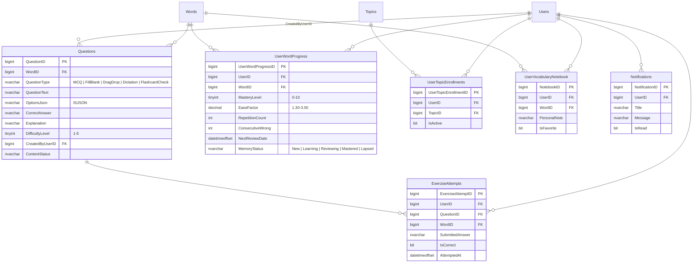
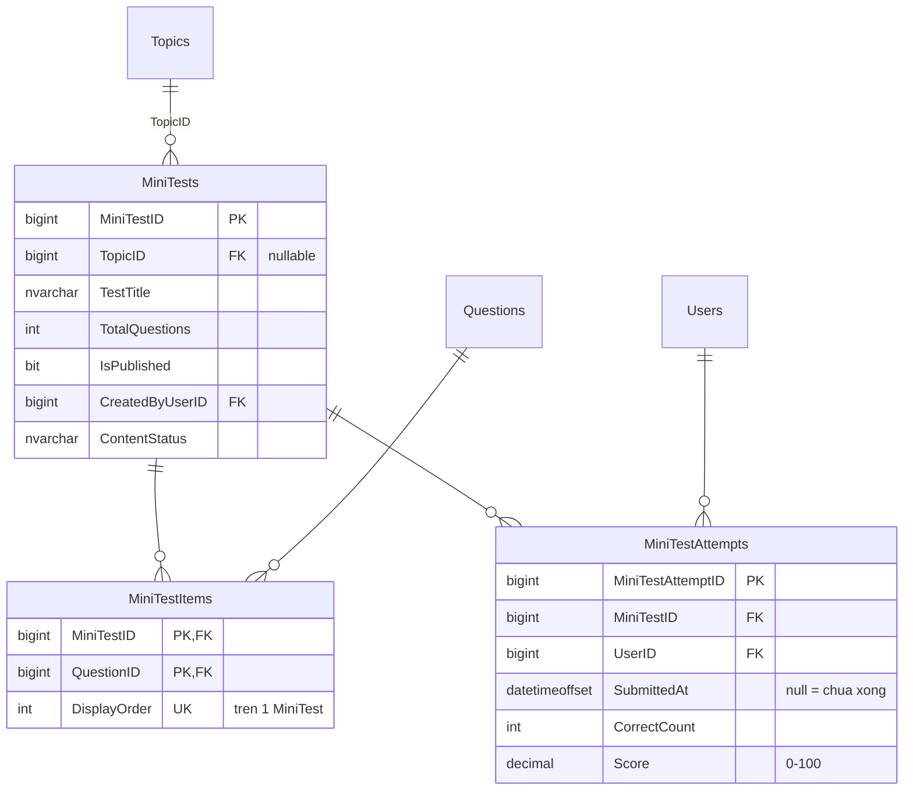
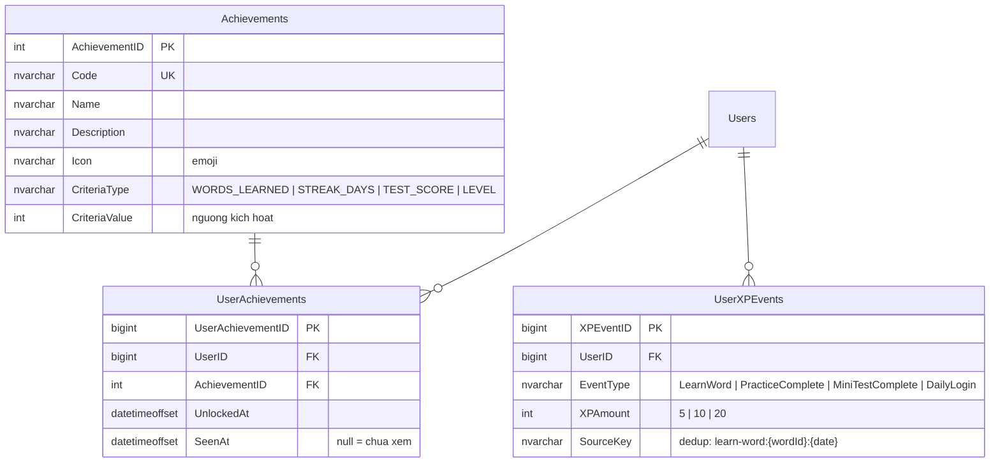
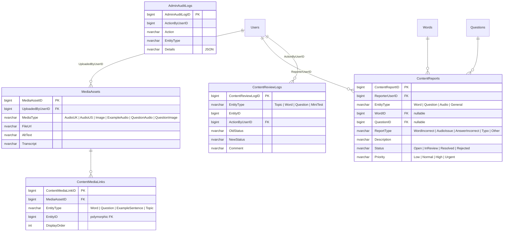
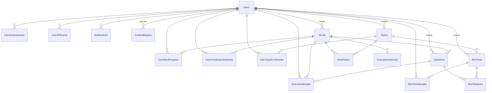

# ERD Tổng quan — Hệ thống VocaBoost

> 29 tables, SQL Server. 6 nhóm: Core → Nội dung → Học tập → Mini Test → Gamification → Lộ trình

---

## 1. Core — Người dùng & Phân quyền



---

## 2. Nội dung từ vựng



---

## 3. Học tập & Luyện tập



---

## 4. Mini Test



---

## 5. Gamification



---

## 6. Lộ trình học tập

```mermaid
erDiagram
    LearningPathLevels {
        int LearningPathLevelID PK
        nvarchar LevelCode UK "TOEIC_300 | TOEIC_500 | TOEIC_700 | TOEIC_900"
        nvarchar LevelName
        int TargetScore
        int DisplayOrder UK
        nvarchar AccentKey "sky | emerald | amber | violet"
    }

    LearningPathTopics {
        bigint LearningPathTopicID PK
        int LearningPathLevelID FK
        bigint TopicID FK UK "1 topic chi 1 level"
        int DisplayOrder
        bit IsRequired "default 1"
    }

    LearningPathLevels ||--o{ LearningPathTopics: ""
    Topics ||--o{ LearningPathTopics: ""
```

---

## 7. Quản lý nội dung



---

## Tổng quan — Quan hệ chính



---

## Chú thích

- `PK`: Primary Key
- `FK`: Foreign Key
- `UK`: Unique Key
- `||--o{`: 1-N relationship
- `||--||`: 1-1 relationship
- `}o--o{`: M-N relationship (qua bảng trung gian)

### XP Rewards

| Event | XP | SourceKey dedup |
|---|---|---|
| LearnWord | +5 | `learn-word:{wordId}:{YYYY-MM-DD}` |
| PracticeComplete | +10 | `practice:{sessionKey}` |
| MiniTestComplete | +20 | `mini-test-attempt:{attemptId}` |
| DailyLogin | +5 | `daily-login:{YYYY-MM-DD}` |

### SRS Memory Status

```
New → Learning → Reviewing → Mastered
  ↓ (sai)                                  (sai)
Lapsed ←─────────────────────────────────
```

### Content Review Workflow

```
Draft → PendingReview → Published
                      → Rejected → Draft
Any → Archived
```
