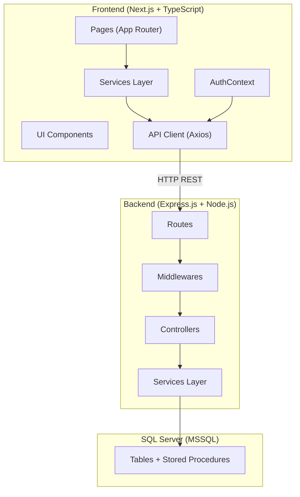
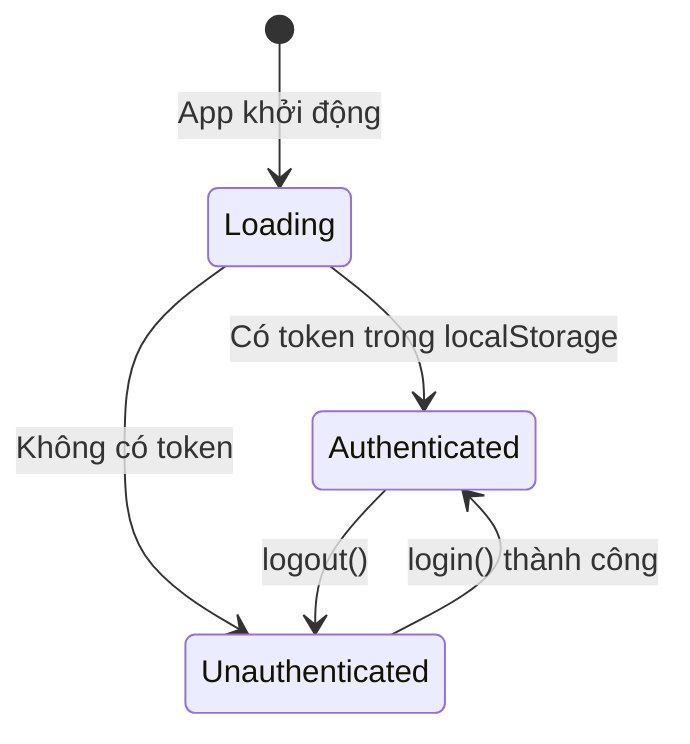
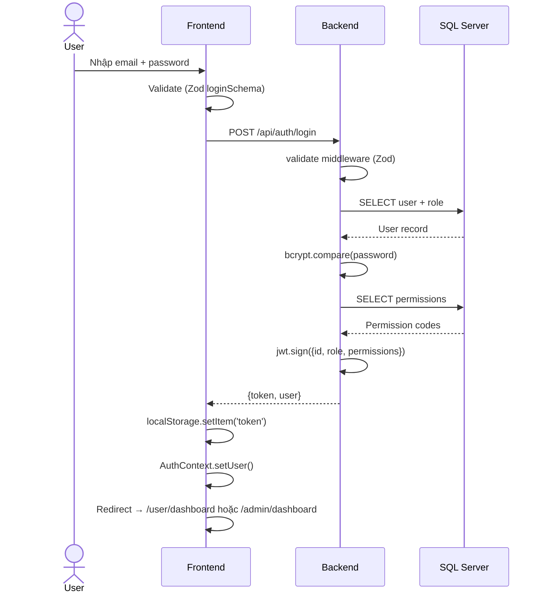
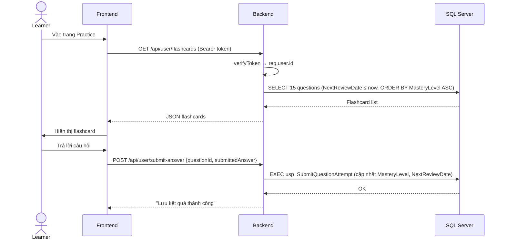
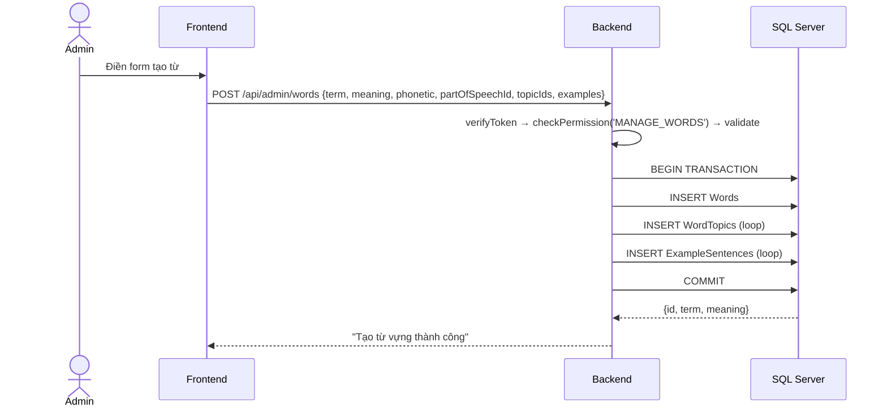
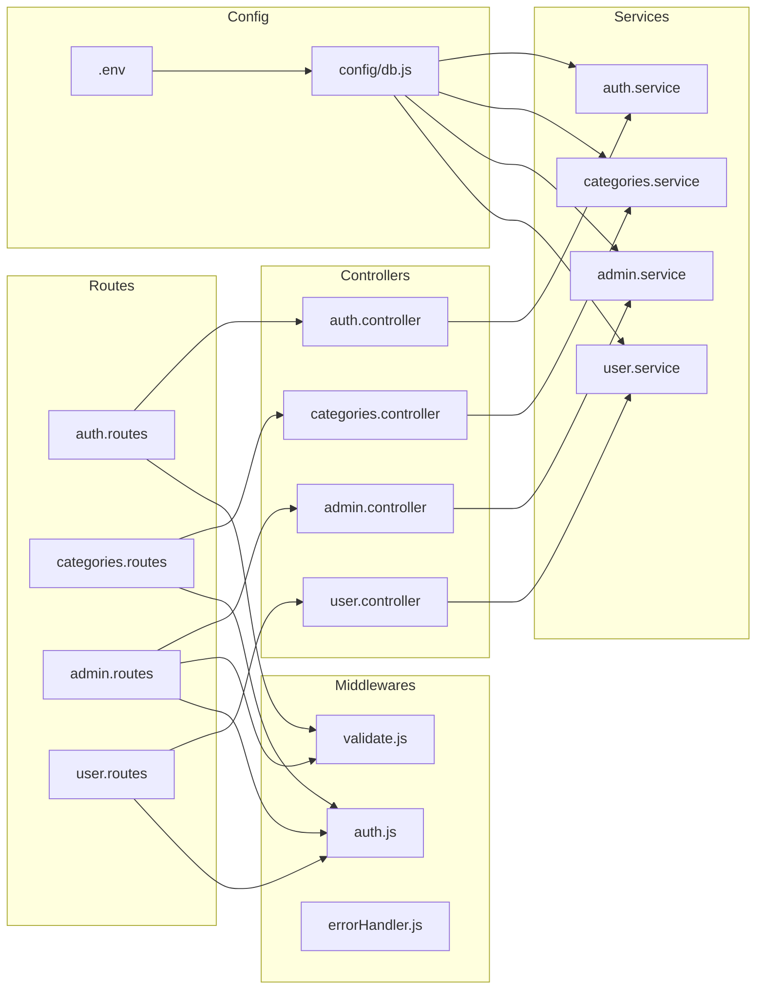

# 📖 Tài liệu Hệ thống VocaBoost – Học Từ Vựng Tiếng Anh

## 1. Tổng quan Kiến trúc



**Kiến trúc 3 tầng:** Frontend (Next.js) → Backend (Express REST API) → Database (SQL Server)

---

## 2. Backend – Chi tiết từng file

### 2.1. `src/index.js` – Entry Point

| Chức năng | Mô tả |
|---|---|
| Khởi tạo Express app | Cấu hình `helmet`, `cors`, `express.json()` |
| Request Logger | Log mọi request với timestamp |
| Health Check | `GET /api/health` – kiểm tra kết nối DB |
| Mount Routes | Gắn 4 nhóm route: `auth`, `categories`, `admin`, `user` |
| Error Handler | Middleware bắt lỗi cuối cùng |
| Graceful Shutdown | Đóng DB pool khi nhận `SIGTERM`/`SIGINT` |

**Tác động:** File này là điểm khởi đầu, kết nối tất cả các module lại với nhau.

---

### 2.2. `src/config/db.js` – Kết nối Database

- Dùng thư viện `mssql` để tạo **Connection Pool** tới SQL Server
- Đọc cấu hình từ `.env`: `DB_SERVER`, `DB_USER`, `DB_PASSWORD`, `DB_NAME`
- Export `poolPromise` (singleton) và `sql` object để dùng ở Services

**Tác động với file khác:** Mọi Service (`auth.service.js`, `admin.service.js`, `user.service.js`, `categories.service.js`) đều import `poolPromise` từ file này để truy vấn DB.

---

### 2.3. Middlewares

#### `middlewares/auth.js` – Xác thực & Phân quyền

| Hàm | Chức năng | Được dùng ở |
|---|---|---|
| `verifyToken(req, res, next)` | Giải mã JWT từ header `Authorization: Bearer <token>`, gắn `req.user` | Tất cả routes cần đăng nhập |
| `verifyAdmin(req, res, next)` | Kiểm tra `req.user.role === 'Admin'` | Routes admin (hiện không dùng trực tiếp, thay bằng `checkPermission`) |
| `checkPermission(code)` | Factory function trả về middleware kiểm tra `req.user.permissions` có chứa `code` không | Mọi route admin (`MANAGE_WORDS`, `MANAGE_QUESTIONS`, `VIEW_DASHBOARD`, `MANAGE_TESTS`, `MANAGE_USERS`) |

**Luồng hoạt động:**
```
Request → verifyToken (decode JWT) → checkPermission('MANAGE_WORDS') → Controller
```

#### `middlewares/validate.js` – Validation dữ liệu đầu vào

- Dùng thư viện **Zod** để định nghĩa schema
- Hàm `validate(schema)` trả về middleware parse `req.body/query/params`

| Schema | Validation | Dùng ở Route |
|---|---|---|
| `schemas.register` | `fullName` ≥ 2 ký tự, email hợp lệ, password ≥ 6 | `POST /auth/register` |
| `schemas.login` | email hợp lệ, password ≥ 1 | `POST /auth/login` |
| `schemas.createWord` | `term`, `meaning` không rỗng, `partOfSpeechId` là số | `POST /admin/words` |
| `schemas.createQuestion` | `wordId` số, `questionType` enum, `questionText` ≥ 5, `correctAnswer` ≥ 1 | `POST /admin/questions` |

#### `middlewares/errorHandler.js` – Xử lý lỗi toàn cục

- Bắt mọi error không được xử lý trong controller
- Trả về `500` với message lỗi

---

### 2.4. Routes – Định tuyến API

#### `routes/auth.routes.js`
| Method | Path | Middleware | Controller |
|---|---|---|---|
| POST | `/api/auth/register` | `validate(register)` | `AuthController.register` |
| POST | `/api/auth/login` | `validate(login)` | `AuthController.login` |

#### `routes/categories.routes.js`
| Method | Path | Middleware | Controller |
|---|---|---|---|
| GET | `/api/categories/part-of-speeches` | `verifyToken` | `CategoriesController.getPartOfSpeeches` |
| GET | `/api/categories/topics` | `verifyToken` | `CategoriesController.getTopics` |

#### `routes/admin.routes.js`
| Method | Path | Permission | Controller |
|---|---|---|---|
| GET | `/api/admin/words` | `MANAGE_WORDS` | `AdminController.getWords` |
| POST | `/api/admin/words` | `MANAGE_WORDS` | `AdminController.createWord` |
| PUT | `/api/admin/words/:id` | `MANAGE_WORDS` | `AdminController.updateWord` |
| DELETE | `/api/admin/words/:id` | `MANAGE_WORDS` | `AdminController.deleteWord` |
| GET | `/api/admin/questions/:wordId` | `MANAGE_QUESTIONS` | `AdminController.getQuestionsByWord` |
| POST | `/api/admin/questions` | `MANAGE_QUESTIONS` | `AdminController.createQuestion` |
| GET | `/api/admin/minitests` | `MANAGE_TESTS` | `AdminController.getMiniTests` |
| POST | `/api/admin/minitests` | `MANAGE_TESTS` | `AdminController.createMiniTest` |
| GET | `/api/admin/stats` | `VIEW_DASHBOARD` | `AdminController.getStats` |
| GET | `/api/admin/students` | `MANAGE_USERS` | `AdminController.getStudents` |
| PATCH | `/api/admin/students/:id/toggle` | `MANAGE_USERS` | `AdminController.toggleStudentStatus` |
| GET | `/api/admin/analytics` | `VIEW_DASHBOARD` | `AdminController.getAnalytics` |

#### `routes/user.routes.js`
| Method | Path | Middleware | Controller |
|---|---|---|---|
| POST | `/api/user/submit-answer` | `verifyToken` | `UserController.submitAnswer` |
| GET | `/api/user/flashcards` | `verifyToken` | `UserController.getFlashcards` |
| GET | `/api/user/stats` | `verifyToken` | `UserController.getStats` |
| GET | `/api/user/minitests` | `verifyToken` | `UserController.getMiniTests` |
| GET | `/api/user/minitests/history` | `verifyToken` | `UserController.getTestHistory` |
| GET | `/api/user/minitests/session-details` | `verifyToken` | `UserController.getTestSessionDetails` |
| GET | `/api/user/minitests/:id` | `verifyToken` | `UserController.getMiniTestDetails` |
| PUT | `/api/user/profile` | `verifyToken` | `UserController.updateProfile` |

---

### 2.5. Controllers – Xử lý Request/Response

Controllers đóng vai trò **trung gian** giữa Routes và Services. Chúng:
1. Trích xuất dữ liệu từ `req.params`, `req.query`, `req.body`, `req.user`
2. Gọi hàm tương ứng trong Service
3. Trả response JSON hoặc forward error cho `errorHandler`

| Controller | Gọi Service | Số hàm |
|---|---|---|
| `AuthController` | `AuthService` | 2 (`register`, `login`) |
| `CategoriesController` | `CategoriesService` | 2 (`getPartOfSpeeches`, `getTopics`) |
| `AdminController` | `AdminService` | 10 (CRUD words, questions, minitests, stats, students, analytics) |
| `UserController` | `UserService` | 8 (flashcards, submit, stats, minitests, history, profile) |

---

### 2.6. Services – Business Logic & Database Queries

#### `services/auth.service.js`

| Hàm | Chức năng | Tables liên quan |
|---|---|---|
| `register(fullName, email, password)` | Kiểm tra email trùng → hash password (bcrypt) → INSERT user với role `Learner` | `Users`, `Roles` |
| `login(email, password)` | Tìm user → so sánh password → lấy permissions → tạo JWT token (1 ngày) | `Users`, `Roles`, `RolePermissions`, `Permissions` |

**JWT Payload:** `{ id, fullName, role, permissions[] }`

#### `services/categories.service.js`

| Hàm | Chức năng | Tables |
|---|---|---|
| `getPartOfSpeeches()` | Lấy danh sách loại từ (Noun, Verb...) | `PartOfSpeeches` |
| `getTopics()` | Lấy danh sách chủ đề (Business, Travel...) | `Topics` |

#### `services/admin.service.js`

| Hàm | Chức năng | Tables |
|---|---|---|
| `getWords(page, limit)` | Phân trang từ vựng + lấy topics, examples cho mỗi từ | `Words`, `PartOfSpeeches`, `WordTopics`, `Topics`, `ExampleSentences` |
| `createWord(data, adminId)` | Transaction: INSERT word → INSERT word-topics → INSERT examples | `Words`, `WordTopics`, `ExampleSentences` |
| `updateWord(wordId, data)` | UPDATE thông tin từ vựng | `Words` |
| `deleteWord(wordId)` | Transaction: DELETE word (CASCADE xóa topics, examples, questions) | `Words` |
| `getQuestionsByWord(wordId)` | Lấy câu hỏi theo wordId | `Questions` |
| `createQuestion(data, adminId)` | INSERT câu hỏi mới | `Questions` |
| `getMiniTests()` | Lấy danh sách Mini Test | `MiniTests`, `Topics` |
| `createMiniTest(data, adminId)` | Transaction: INSERT test → INSERT test items theo thứ tự | `MiniTests`, `MiniTestItems` |
| `getDashboardStats()` | Đếm: students, words, topics, attempts | `Users`, `Words`, `Topics`, `ExerciseAttempts` |
| `getStudents()` | Danh sách Learner + số từ đã master | `Users`, `UserWordProgress` |
| `toggleUserStatus(userId)` | Bật/tắt trạng thái `IsActive` | `Users` |
| `getAnalyticsData()` | Xu hướng 7 ngày + phân bố từ theo loại | `ExerciseAttempts`, `PartOfSpeeches`, `Words` |

#### `services/user.service.js`

| Hàm | Chức năng | Tables |
|---|---|---|
| `getDueFlashcards(userId)` | Lấy 15 flashcard cần ôn tập (theo Spaced Repetition) | `Questions`, `Words`, `UserWordProgress` |
| `submitAnswer(data)` | Gọi stored procedure `usp_SubmitQuestionAttempt` | `ExerciseAttempts`, `UserWordProgress` |
| `getUserStats(userId)` | Tổng hợp: từ đã học, accuracy, weak words, recent attempts, daily trends, achievements | `UserWordProgress`, `ExerciseAttempts`, `Words` |
| `getMiniTests()` | Danh sách Mini Test đã publish | `MiniTests`, `Topics` |
| `getMiniTestDetails(testId)` | Chi tiết câu hỏi trong 1 test | `MiniTestItems`, `Questions`, `Words` |
| `updateProfile(userId, fullName)` | Cập nhật tên người dùng | `Users` |
| `getTestHistory(userId)` | Lịch sử làm test theo ngày | `ExerciseAttempts`, `Questions`, `MiniTestItems`, `MiniTests` |
| `getTestSessionDetails(userId, testId, date)` | Chi tiết 1 phiên làm test | Giống trên + `Words` |

---

## 3. Frontend – Chi tiết từng file

### 3.1. `src/lib/api-client.ts` – HTTP Client

- Tạo instance Axios với `baseURL = http://localhost:3001/api`
- **Request Interceptor:** Tự động gắn `Authorization: Bearer <token>` từ `localStorage`
- **Response Interceptor:** Nếu nhận 401, xóa token/user khỏi localStorage

**Tác động:** Tất cả frontend services đều import file này để gọi API.

### 3.2. `src/lib/validations.ts` – Form Validation (Zod)

| Schema | Fields | Dùng ở |
|---|---|---|
| `loginSchema` | email (email), password (≥1) | Trang Login |
| `registerSchema` | fullName (≥2), email, password (≥6) | Trang Register |

### 3.3. `src/app/context/AuthContext.tsx` – Quản lý Authentication



| Property/Method | Chức năng |
|---|---|
| `user` | Object user hiện tại (id, fullName, email, role) |
| `token` | JWT token |
| `loading` | Trạng thái đang load |
| `login(data)` | Gọi `authService.login()` → cập nhật state |
| `logout()` | Xóa localStorage → redirect `/login` |
| `isAuthenticated` | `!!token` |
| `isAdmin` | `user?.role === 'Admin'` |

**Tác động:** Wrap toàn bộ app trong `RootLayout` → mọi page đều truy cập được qua `useAuth()`.

### 3.4. Frontend Services – Gọi API

Mỗi service tương ứng 1 nhóm API backend:

| File | Hàm | Endpoint Backend |
|---|---|---|
| `auth.service.ts` | `register(data)` | `POST /auth/register` |
| | `login(data)` | `POST /auth/login` + lưu token vào localStorage |
| | `logout()` | Xóa localStorage |
| | `getCurrentUser()` | Đọc từ localStorage |
| `admin.service.ts` | `getWords(page, limit)` | `GET /admin/words` |
| | `createWord(data)` | `POST /admin/words` |
| | `updateWord(id, data)` | `PUT /admin/words/:id` |
| | `deleteWord(id)` | `DELETE /admin/words/:id` |
| | `getQuestionsByWord(wordId)` | `GET /admin/questions/:wordId` |
| | `createQuestion(data)` | `POST /admin/questions` |
| | `getStats()` | `GET /admin/stats` |
| | `getStudents()` | `GET /admin/students` |
| | `toggleStudentStatus(id)` | `PATCH /admin/students/:id/toggle` |
| | `getAnalytics()` | `GET /admin/analytics` |
| `user.service.ts` | `getDueFlashcards()` | `GET /user/flashcards` |
| | `getStats()` | `GET /user/stats` |
| | `submitAnswer(data)` | `POST /user/submit-answer` |
| | `getMiniTests()` | `GET /user/minitests` |
| | `getTestHistory()` | `GET /user/minitests/history` |
| | `getTestSessionDetails(testId, date)` | `GET /user/minitests/session-details` |
| | `getMiniTestDetails(id)` | `GET /user/minitests/:id` |
| | `updateProfile(data)` | `PUT /user/profile` |
| `categories.service.ts` | `getPartOfSpeeches()` | `GET /categories/part-of-speeches` |
| | `getTopics()` | `GET /categories/topics` |

### 3.5. Layouts – Bảo vệ Route

| Layout | Điều kiện | Redirect |
|---|---|---|
| `user/layout.tsx` | Phải `isAuthenticated` | → `/login` |
| `admin/layout.tsx` | Phải `isAuthenticated` + `isAdmin` | → `/login` hoặc `/user/dashboard` |

### 3.6. Cấu trúc Pages

```
app/
├── page.tsx              → Landing page (Navbar, Hero, Features, Courses, HowItWorks, Testimonials, Pricing, Footer)
├── login/                → Trang đăng nhập
├── register/             → Trang đăng ký
├── user/                 → Khu vực Learner (cần đăng nhập)
│   ├── dashboard/        → Bảng điều khiển học viên
│   ├── learn/            → Học từ vựng mới
│   ├── practice/         → Luyện tập flashcard
│   ├── minitests/        → Làm Mini Test
│   │   └── history/      → Lịch sử làm bài
│   ├── courses/          → Khóa học
│   ├── progress/         → Tiến độ học tập
│   ├── achievements/     → Thành tựu
│   └── settings/         → Cài đặt cá nhân
├── admin/                → Khu vực Admin (cần Admin role)
│   ├── dashboard/        → Thống kê tổng quan
│   ├── words/            → Quản lý từ vựng
│   ├── questions/        → Quản lý câu hỏi
│   ├── minitests/        → Quản lý Mini Test
│   ├── students/         → Quản lý học viên
│   ├── courses/          → Quản lý khóa học
│   ├── analytics/        → Phân tích dữ liệu
│   └── settings/         → Cài đặt hệ thống
```

---

## 4. Luồng hoạt động chính

### 4.1. Đăng nhập



### 4.2. Học Flashcard (Spaced Repetition)



### 4.3. Admin tạo từ vựng



---

## 5. Sơ đồ quan hệ File



---

## 6. Kế hoạch phát triển theo giai đoạn

### Giai đoạn 1: Nền tảng (Foundation) ✅ Đã hoàn thành
- [x] Thiết kế Database Schema (SQL Server)
- [x] Cấu hình kết nối DB (`config/db.js`)
- [x] Xây dựng hệ thống xác thực JWT (`auth.service`, `auth middleware`)
- [x] Hệ thống phân quyền RBAC (Role-Based Access Control)
- [x] Validation input với Zod
- [x] Error handling middleware
- [x] Frontend: API Client + AuthContext

### Giai đoạn 2: Core Features ✅ Đã hoàn thành
- [x] CRUD Từ vựng (Words + Topics + Examples)
- [x] CRUD Câu hỏi (Questions: MCQ, FillBlank, Dictation, FlashcardCheck)
- [x] Hệ thống Flashcard với Spaced Repetition
- [x] Submit & chấm bài (Stored Procedure `usp_SubmitQuestionAttempt`)
- [x] Dashboard thống kê (Admin + User)

### Giai đoạn 3: Testing & Assessment ✅ Đã hoàn thành
- [x] Mini Test: tạo, liệt kê, làm bài
- [x] Lịch sử làm bài (Test History)
- [x] Chi tiết phiên làm bài (Session Details)
- [x] Quản lý học viên (Students CRUD + toggle status)

### Giai đoạn 4: Analytics & Gamification ✅ Đã hoàn thành
- [x] User Stats: accuracy, weak words, daily trends
- [x] Admin Analytics: daily activity, word distribution
- [x] Achievement system (8 huy hiệu)
- [x] Landing page (Hero, Features, Courses, HowItWorks, Testimonials, Pricing)

### Giai đoạn 5: Tối ưu & Mở rộng (Planned)
- [ ] Tối ưu N+1 query trong `getWords()` (batch query thay vì loop)
- [ ] Thêm caching layer (Redis)
- [ ] Pagination cho tất cả list endpoints
- [ ] Image/Audio upload cho từ vựng
- [ ] Real-time notification (WebSocket)
- [ ] Export/Import dữ liệu (CSV/Excel)
- [ ] Unit tests + Integration tests
- [ ] CI/CD pipeline
- [ ] Docker deployment

---

## 7. Database Tables chính

| Table | Mục đích | Quan hệ chính |
|---|---|---|
| `Users` | Lưu thông tin người dùng | → `Roles` (FK: RoleID) |
| `Roles` | Admin, ContentCreator, Learner | → `RolePermissions` |
| `Permissions` | Mã quyền (MANAGE_WORDS, VIEW_DASHBOARD...) | → `RolePermissions` |
| `RolePermissions` | Mapping Role ↔ Permission | Join table |
| `Words` | Từ vựng (term, meaning, phonetic) | → `PartOfSpeeches`, → `WordTopics`, → `ExampleSentences`, → `Questions` |
| `PartOfSpeeches` | Loại từ (Noun, Verb, Adj...) | ← `Words` |
| `Topics` | Chủ đề (Business, Travel...) | ← `WordTopics`, ← `MiniTests` |
| `WordTopics` | Mapping Word ↔ Topic | Join table |
| `ExampleSentences` | Câu ví dụ cho từ vựng | → `Words` |
| `Questions` | Câu hỏi (MCQ, FillBlank...) | → `Words`, ← `MiniTestItems`, ← `ExerciseAttempts` |
| `MiniTests` | Bộ đề kiểm tra | → `Topics` |
| `MiniTestItems` | Câu hỏi trong test + thứ tự | → `MiniTests`, → `Questions` |
| `ExerciseAttempts` | Lịch sử làm bài | → `Users`, → `Questions`, → `Words` |
| `UserWordProgress` | Tiến độ học từng từ (MasteryLevel, NextReviewDate, MemoryStatus) | → `Users`, → `Words` |
