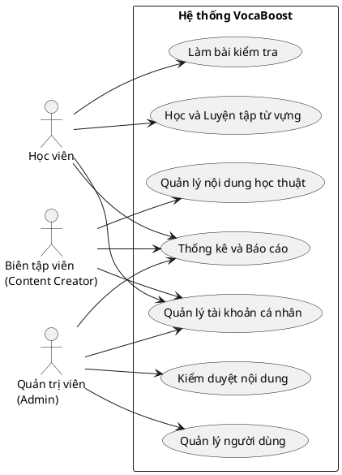
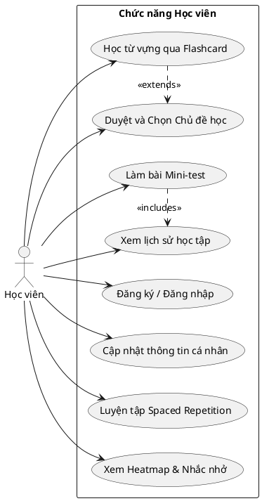
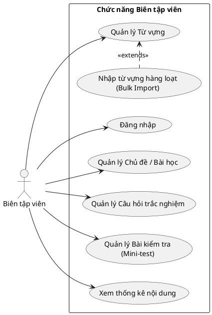
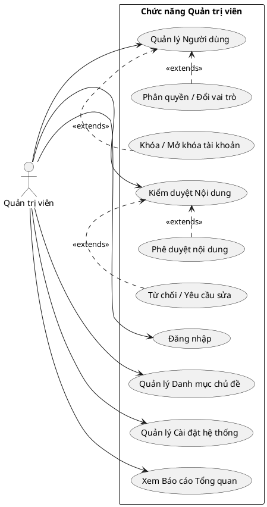

# 3. Biểu đồ Use-case Hệ thống VocaBoost

Dưới đây là mã nguồn vẽ các biểu đồ Use-case chuẩn bằng **PlantUML**. PlantUML là ngôn ngữ chuyên dụng và chuẩn xác nhất để vẽ Use-case (tạo ra hình người que cho Actor và hình ellipse chuẩn cho Use-case). 

*Lưu ý: Bạn có thể copy mã nguồn này dán vào **[PlantText](https://www.planttext.com/)** hoặc chọn chức năng chèn PlantUML trong **Draw.io** để tải ảnh về báo cáo.*

## 3.1. Biểu đồ Use-case tổng quan hệ thống VocaBoost

---

## 3.2. Biểu đồ Use-case phân rã theo tác nhân

### 3.2.1. Phân rã Use-case của tác nhân "Học viên"

---

### 3.2.2. Phân rã Use-case của tác nhân "Biên tập viên (Content Creator)"

---

### 3.2.3. Phân rã Use-case của tác nhân "Quản trị viên (Admin)"

