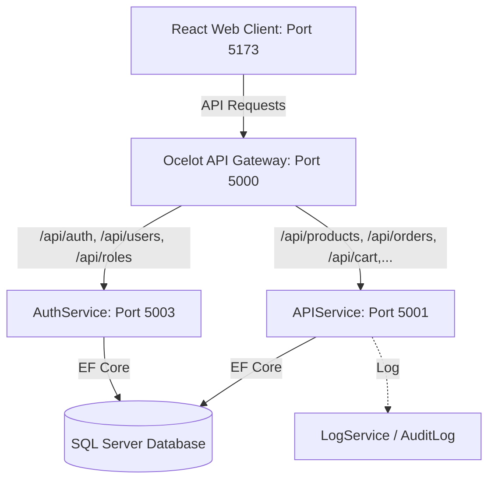
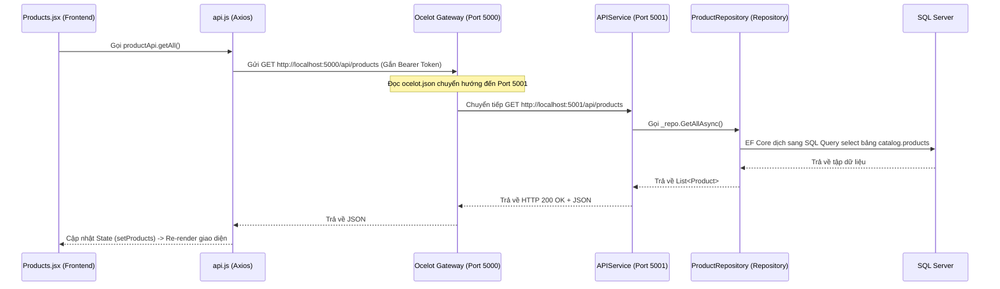

Listed directory Project_Web_nam3_ky2
Listed directory BaseCore
Listed directory document
Viewed luonghoatdong.md:1-91
Viewed viet_module.md:1-217
Viewed database_know.md:1-125
Viewed vandap.md:1-103

### 1. Kiến trúc hệ thống tổng quan (System Architecture)

Hệ thống được thiết kế theo kiến trúc **Microservices / SOA (Service-Oriented Architecture)** ở Backend phối hợp với **SPA (Single Page Application)** ở Frontend.



- **Frontend (React Web Client):** Chạy trên cổng `5173`. Giao diện viết bằng React + Vite, styling bằng Bootstrap 5. Quản lý gọi API tập trung qua **Axios** (`src/services/api.js`).
- **Ocelot API Gateway (BaseCore.ApiGateway):** Chạy trên cổng `5000`. Đóng vai trò là **Single Entry Point** tiếp nhận mọi request từ Frontend, sau đó định tuyến (route) dựa trên file cấu hình `ocelot.json` tới service Backend tương ứng.
- **AuthService (BaseCore.AuthService):** Chạy trên cổng `5003`. Quản lý Authentication & Authorization. Cấp phát **JWT Token** khi đăng nhập thành công.
- **APIService (BaseCore.APIService):** Chạy trên cổng `5001`. Chứa toàn bộ logic nghiệp vụ (Products, Orders, Carts, v.v.).
- **Database (SQL Server):** Sử dụng **Entity Framework Core 8 (Code-First)**. Dữ liệu phân rã thành 4 **Schema** nghiệp vụ: `auth` (xác thực), `catalog` (sản phẩm), `orders` (đơn hàng), và `sales` (khuyến mãi & cấu hình thanh toán).

---

### 2. Cấu trúc thư mục cốt lõi

Dự án được chia thành hai phần chính:

#### A. Backend (.NET Core Solutions)

- **`BaseCore.ApiGateway`:** Chứa file `ocelot.json` định tuyến API.
- **`BaseCore.AuthService`:** Controller và logic liên quan đến tài khoản, phân quyền.
- **`BaseCore.APIService`:** Controller và logic nghiệp vụ chính (E-commerce).
- **`BaseCore.Entities`:** Định nghĩa các thực thể (Entities/Models) tương ứng với bảng trong Database (ví dụ: `Product.cs`, `Order.cs`).
- **`BaseCore.Repository`:** Chứa `SQLServerDbContext.cs` và các class Repository chịu trách nhiệm truy vấn database qua **EF Core**.

#### B. Frontend (`BaseCore.WebClient`)

- **`src/services/api.js`:** Cấu hình **Axios Instance**, tự động đính kèm JWT Token vào Header của request (Request Interceptor) và bắt lỗi `401 Unauthorized` để logout nếu token hết hạn (Response Interceptor).
- **`src/pages/`:** Chứa các màn hình giao diện (ví dụ: `Products.jsx` - quản lý sản phẩm, `Orders.jsx` - quản lý đơn hàng).
- **`src/App.jsx`:** Cấu hình Routing chính của React Application.

---

### 3. Luồng hoạt động của Code (Code Execution Flow)

Lấy ví dụ khi người dùng thao tác trên màn hình Quản lý Sản phẩm (`Products.jsx`):



- **Bước 1 (Frontend UI):** `Products.jsx` sử dụng `useEffect` gọi hàm `productApi.getAll()` trong `services/api.js`.
- **Bước 2 (Axios Interceptor):** Axios lấy JWT token lưu trong `localStorage` gắn vào header `Authorization: Bearer <token>` rồi bắn request đi.
- **Bước 3 (API Gateway):** Gateway (cổng `5000`) nhận request `/api/products`, so khớp cấu hình `ocelot.json` và chuyển tiếp (downstream) đến APIService (cổng `5001`).
- **Bước 4 (APIService Controller):** `ProductsController.cs` nhận request, check quyền `[Authorize]`. Nếu hợp lệ, gọi đến Repository thông qua Dependency Injection (`IProductRepository`).
- **Bước 5 (Database Access):** Repository dùng `DbContext` truy vấn bảng `catalog.products` dưới SQL Server. Dữ liệu trả ngược lên theo chuỗi và hiển thị trên giao diện React.

---

### 4. Quy trình 7 bước khi viết một tính năng mới (Add New Module)

Để thêm một tính năng (ví dụ: Quản lý nhà vận chuyển - Shipments), bạn đi theo thứ tự:

1. **Định nghĩa Entity:** Tạo class `Shipment.cs` trong `BaseCore.Entities`.
2. **Cấu hình DB & Migration:**
   - Đăng ký `DbSet<Shipment>` vào `SQLServerDbContext.cs` (`BaseCore.Repository`).
   - Chạy lệnh migration để đồng bộ xuống SQL Server:
     ```bash
     dotnet ef migrations add AddShipment --project BaseCore.Repository --startup-project BaseCore.APIService
     dotnet ef database update --project BaseCore.Repository --startup-project BaseCore.APIService
     ```
3. **Viết Repository:** Tạo Interface `IShipmentRepository` và triển khai class `ShipmentRepository` để xử lý CRUD.
4. **Đăng ký DI:** Đăng ký interface trong `Program.cs` của `BaseCore.APIService`:
   ```csharp
   builder.Services.AddScoped<IShipmentRepository, ShipmentRepository>();
   ```
5. **Tạo API Controller:** Viết `ShipmentsController.cs` trong `BaseCore.APIService` để lộ các endpoint CRUD.
6. **Cấu hình Gateway:** Thêm cấu hình route cho `/api/shipments` trong file `ocelot.json` của `BaseCore.ApiGateway`.
7. **Viết Frontend:**
   - Khai báo hàm gọi API trong `src/services/api.js`.
   - Tạo file UI `src/pages/Shipments.jsx`.
   - Đăng ký Route trong `src/App.jsx`.

---

### 5. Hướng dẫn bắt đầu Code nhanh

1. **Chạy cơ sở dữ liệu:** Đảm bảo SQL Server đang hoạt động. Bạn có thể kiểm tra chuỗi kết nối (Connection String) trong file `appsettings.json` của `BaseCore.APIService` và `BaseCore.AuthService`.
2. **Khởi động Backend:**
   - Mở file Solution `BaseCore.sln` bằng Visual Studio.
   - Thiết lập Multiple Startup Projects để chạy đồng thời cả 3 project: `BaseCore.ApiGateway`, `BaseCore.AuthService`, và `BaseCore.APIService`.
3. **Khởi động Frontend:**
   - Di chuyển terminal vào thư mục `BaseCore.WebClient`.
   - Chạy các lệnh:
     ```bash
     npm install
     npm run dev
     ```
   - Truy cập vào địa chỉ `http://localhost:5173`.
